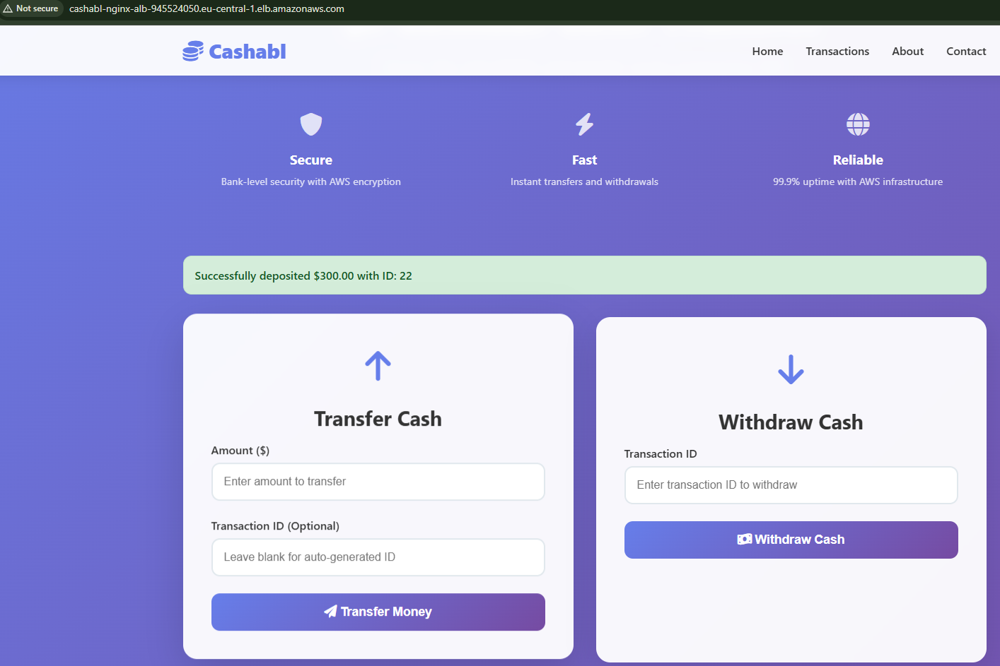
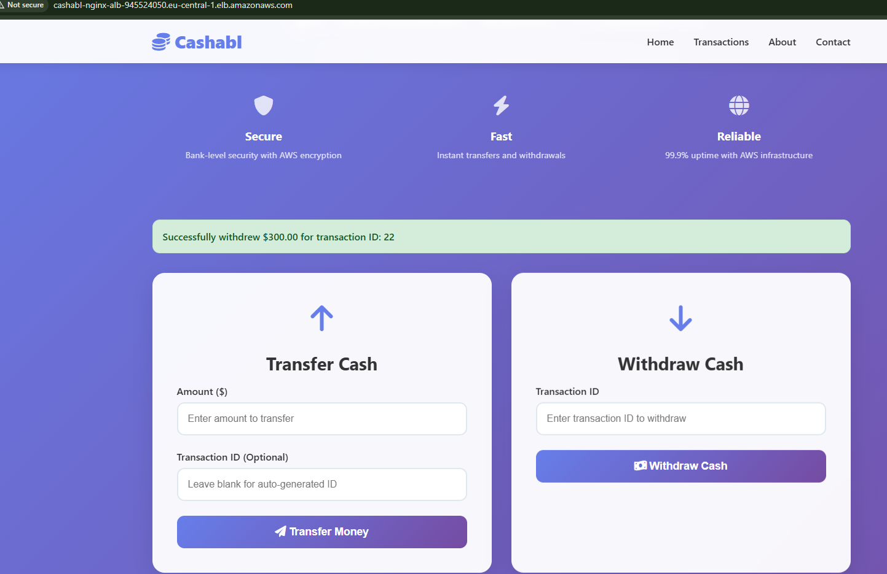
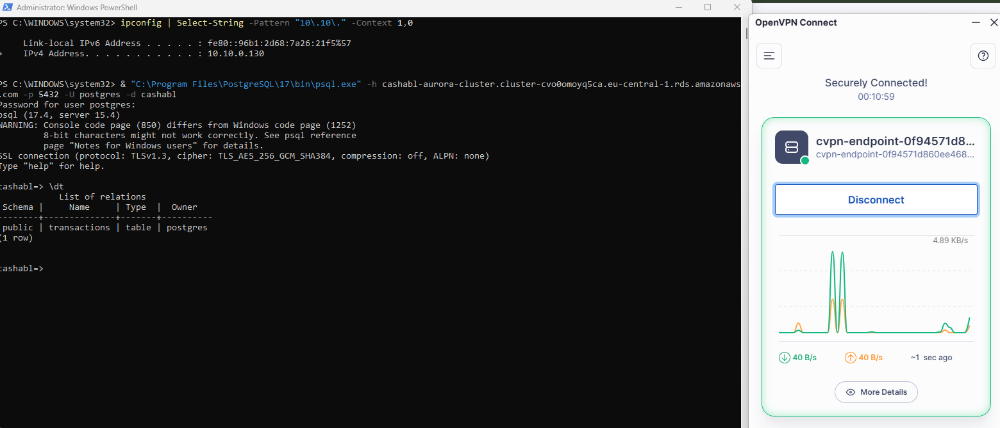
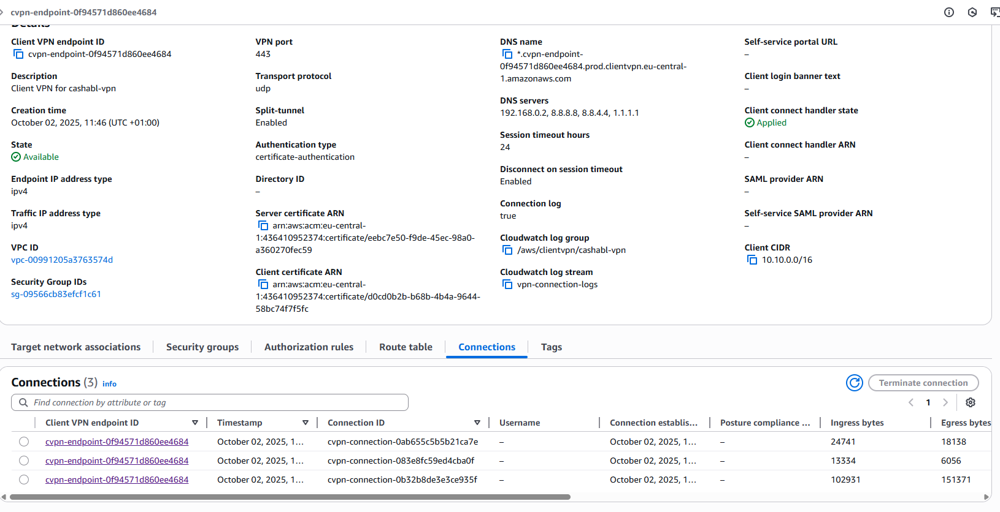

# Test Documentation: Image Descriptions

This document describes the functionality and processes illustrated in the provided screenshots.

## 1. Application Writing to Aurora Database

The `db_app_integration.png` image shows the application's interface for writing data. This demonstrates the primary functionality of the application interacting with the AWS Aurora database backend.

## 2. Withdrawing from Aurora Database

The `db_withdraw.png` image displays the withdrawal feature of the application. This illustrates a read/write operation where funds are withdrawn from an account stored in the Aurora database.

## 3. Local Connection to Aurora via VPN

The `db_connection_from_local.png` image provides evidence of a successful direct connection from a local machine to the Aurora PostgreSQL database. This connection is secured and routed through the AWS Client VPN, demonstrating secure remote access for database management and troubleshooting.

## 4. AWS Client VPN Sessions

The `vpn_connections.png` image shows active sessions in the AWS Client VPN. This confirms that users are connected to the private network, enabling secure access to internal resources like the Aurora database.

